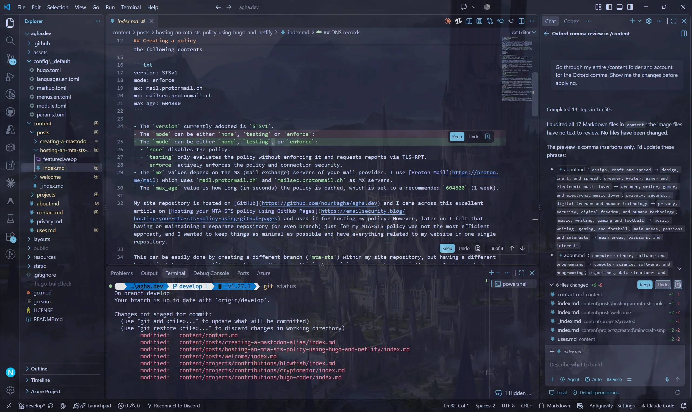
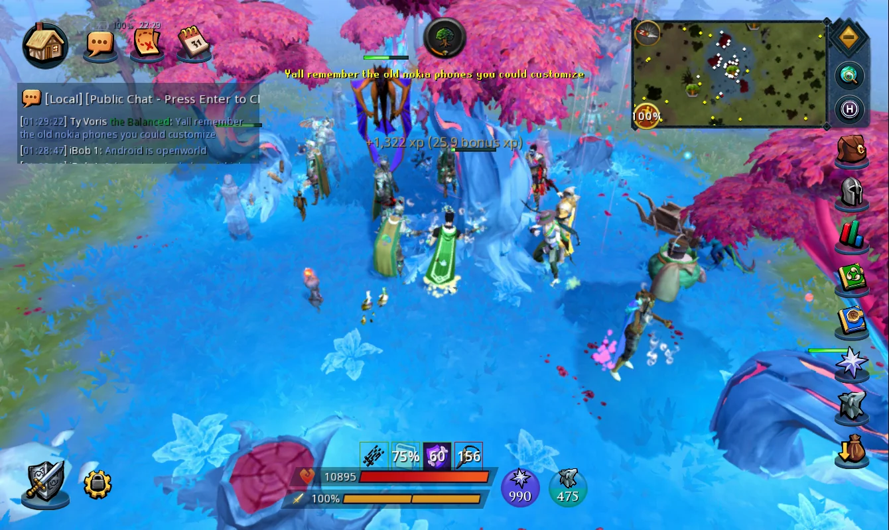

+++
title = "Now"
description = "What I'm focused on right now."
date = "2026-10-09"
lastmod = "2026-10-09"

showDateUpdated = true
showTableOfContents = true
+++

A snapshot of what I've been up to lately. This page is inspired by the [/now page](https://nownownow.com) movement.


I'm focused on growing as a software engineer, building things I care about, taking care of myself, and finding a sustainable balance between work, learning, health, and the things I enjoy.


## Work

At work, I'm building and maintaining systems, documentation, and tooling while troubleshooting software and hardware issues. Alongside my day-to-day responsibilities, I'm exploring and building projects around AI integration and automation. I'm also actively working toward my long-term career goals.

## Projects

I'm continuing to work on my personal projects and contributing to open source projects, as well as shaping [agha.dev](https://agha.dev) into a personal space for my projects, ideas, writing, and experiments. I'm interested in thoughtful design, useful software, and building things with privacy in mind, as well as staying up to date with AI and agentic development.

*VS Code with GitHub Copilot: Standardizing document formatting*

## Learning

I’m revisiting programming fundamentals and learning new languages and frameworks. I’m planning to put what I learn into practice through personal projects and tools for communities I care about.

## Health & Fitness

I’m focused on improving my overall fitness and health while building muscle and strength. I train four days a week with an upper/lower split, or three days a week with full-body workouts. My workouts are based on resistance training and progressive overload. Each session starts with stretching and includes 30 minutes of cardio: 10 minutes of incline walking as a warm-up before lifting weights, followed by another 20 minutes of incline walking at the end to burn extra calories.

I’m building sustainable long-term habits around meal planning, cooking at home when I can, a balanced whole-food diet, supplements, and self-care routines.

## Gaming

I'm getting back into RuneScape after a long break, catching up on the latest content and working toward reachieving Completionist along the way. It's a chance to rediscover the game, experience what's changed, and work toward reclaiming my Completionist Cape.

In November, I'm also planning to return to World of Warcraft through WoW Forever, revisiting Azeroth and reconnecting with a world I've always enjoyed and that holds many memories.

*RuneScape: Cutting eternal magic trees for 110 Woodcutting*

## Music

I'm looking to reconnect with my passion for electronic music through mixing and production. I'd love to spend more time exploring that creative, artistic, and emotional side again, experimenting with sounds, and rediscovering the joy of creating and sharing music.

Lately, I've been listening to a lot of deep, progressive, and melodic house and techno, as well as chillout and downtempo. I've also been keeping up with Above & Beyond and releases from their Anjunabeats, Anjunadeep, and newer Anjunachill labels. I've been exploring music from artists like Mahmut Orhan, Guy Didden, Into The Ether, Because of Art, Jan Blomqvist, mölly, and Marten Lou.

Some of my favorite discoveries this year have been Planet of Souls for their cinematic electronic downtempo style and ethereal vocals, and Lynnic & ItsArius for their emotional, atmospheric melodic deep house.





## Coffee & Drinks

I've been honing my home barista skills, getting creative with iced coffee and matcha lattes, frappes, homemade cold foams, and smoothies (both drinks and bowls). I love experimenting with different flavors, fruits, and colorful ingredients like blue spirulina, butterfly pea flower, and pink pitaya. I find the creative ritual of making each drink really therapeutic. It's especially satisfying to create something refreshing, energizing, and as healthy as it is delicious, with natural or zero-calorie sweeteners.

{{< carousel aspectRatio="4-5" interval="3000" images="{iced-latte-vanilla-cold-foam.webp,iced-strawberry-matcha-latte.webp,earth-sky-matcha-latte.webp,pink-pitaya-latte.webp,blue-spirulina-smoothie-bowl.webp}" captions="{iced-latte-vanilla-cold-foam.webp:Iced latte with vanilla cold foam,iced-strawberry-matcha-latte.webp:Iced strawberry matcha latte,earth-sky-matcha-latte.webp:Earth sky matcha latte,pink-pitaya-latte.webp:Pink pitaya latte,blue-spirulina-smoothie-bowl.webp:Blue spirulina smoothie bowl}" >}}
